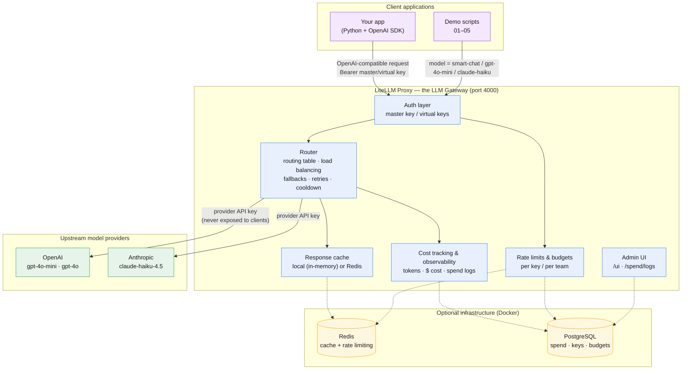

# LLM Gateway Demo (LiteLLM)

A small, runnable sample project that showcases an **LLM gateway** using
[LiteLLM Proxy](https://docs.litellm.ai/docs/simple_proxy). One unified,
OpenAI-compatible API sits in front of multiple providers and adds routing,
fallbacks, caching, cost tracking, and rate limits — without changing your
application code.

## Why a gateway?

Your app talks plain OpenAI SDK to a single endpoint. The gateway handles the
messy parts centrally:

| Feature | What it gives you |
| --- | --- |
| **Multi-provider routing** | Call `model="smart-chat"` and let the gateway pick OpenAI, Anthropic, etc. |
| **Fallbacks & load balancing** | Automatic retries and failover when a provider errors or rate-limits. |
| **Caching** | Identical requests served from cache — lower cost and latency. |
| **Cost & observability** | Per-call token usage + dollar cost, spend logs, admin UI. |
| **Rate limits & budgets** | Scoped virtual keys per team/app with their own caps. |

## Architecture



Clients only ever talk to the gateway with a gateway key; provider credentials
stay inside the gateway. Redis and PostgreSQL (dashed) are optional and only
needed for shared caching, persistent spend logs, and virtual-key budgets.

## Project layout

```
litellm-gateway-demo/
├── config.yaml              # the gateway config (routing, fallbacks, cache, budgets)
├── requirements.txt
├── .env.example             # copy to .env and add your keys
├── docker-compose.yml       # optional Redis + Postgres for the "full" demo
└── demos/
    ├── _client.py                    # shared OpenAI-SDK client -> gateway
    ├── 01_routing.py                 # same request, different providers
    ├── 02_fallbacks.py               # load balancing + failover
    ├── 03_caching.py                 # cache hits on repeated prompts
    ├── 04_cost_and_usage.py          # per-call token usage + cost
    └── 05_virtual_keys_and_budgets.py# mint scoped keys with budgets/limits
```

## Quick start

```bash
# 1. Install  (IMPORTANT: use Python 3.11 or 3.12 — NOT 3.13+/3.14, which
#    breaks LiteLLM's uvloop dependency. If you have `uv`, this is easiest:)
uv venv --python 3.12 .venv
source .venv/bin/activate
uv pip install -r requirements.txt
# (plain venv also works IF `python3.12` is a normal CPython install:
#   python3.12 -m venv .venv && source .venv/bin/activate
#   python -m pip install -r requirements.txt)

# 2. Configure
cp .env.example .env      # then add at least ONE provider key + a master key

# 3. Start the gateway (in one terminal)
set -a; source .env; set +a      # load env vars (handles keys with / + = safely)
litellm --config config.yaml --port 4000 --detailed_debug

# 4. Run a demo (in another terminal, same venv)
cd demos
python 01_routing.py
```

See **GUIDE.md** for the full step-by-step walkthrough, including the optional
Redis/Postgres setup that unlocks persistent spend logs, the admin UI, and
budget-enforcing virtual keys.

## Notes

- **Python 3.11 or 3.12 only.** 3.13+/3.14 break LiteLLM's `uvloop` dependency.
- The gateway terminal (not the demo terminal) is the one that needs the
  provider keys loaded. Use `set -a; source .env; set +a` — the older
  `export $(... xargs)` trick silently corrupts keys with special characters.
- **Model names go stale.** Provider models get retired. If you get a 404 /
  `not_found_error`, list what your key can use, e.g. for Anthropic:
  `curl https://api.anthropic.com/v1/models -H "x-api-key: $ANTHROPIC_API_KEY" -H "anthropic-version: 2023-06-01"`
- You only need **one** provider key to see routing work; the demos degrade
  gracefully if a provider is missing.
- Caching works in-memory (`type: local`) out of the box; add Redis for
  cross-process caching (Redis requires a host — it does NOT auto-fall-back).
- Virtual keys, budgets, and the spend UI require a `DATABASE_URL` (Postgres).
- Pin versions as in `requirements.txt`; LiteLLM's config schema evolves.
