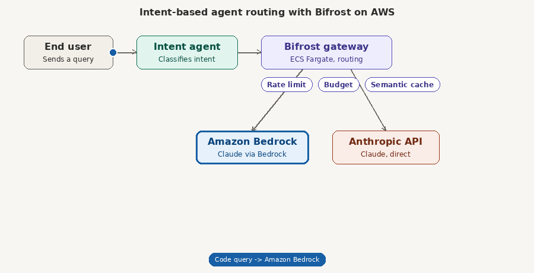
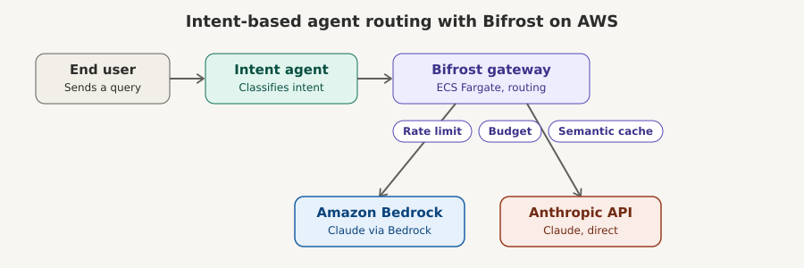

# Hands-on workshop: intent-based agent routing with an LLM gateway on AWS



## What attendees will build

An end-user-facing agent that classifies each incoming query by intent, then forwards it
to **Bifrost** (an open-source LLM gateway) running on **Amazon ECS**. Bifrost routes the
request to the right backend model — **Amazon Bedrock** for one class of workload, the
**native Anthropic API** for another — while enforcing rate limits, tracking token spend,
and serving cached responses for repeated queries.

This mirrors a pattern real platform teams use in production: don't hardcode a single
LLM provider into your application. Put a gateway in the middle so you can route, meter,
cache, and fail over without changing application code.

## Learning objectives

By the end of the workshop, attendees will be able to:

1. Explain why organizations put an LLM gateway between applications and model providers.
2. Deploy Bifrost as a containerized service on Amazon ECS (Fargate).
3. Configure Bifrost with two backend providers — Amazon Bedrock and the Anthropic API —
   and route between them by model string.
4. Build a Python agent that classifies user intent and calls the gateway accordingly.
5. Configure and demonstrate rate limiting, virtual-key budgets (tokenomics), and semantic
   caching, and explain the cost/reliability trade-offs each one buys you.

## Audience & prerequisites

- Comfortable with Python (Flask/FastAPI level) and basic Docker.
- An AWS account with permissions to use ECS, ECR, IAM, Secrets Manager, VPC, and
  Application Load Balancer (or an existing sandbox account provisioned by the instructor).
- Bedrock model access enabled for Anthropic Claude models in the target Region.
- An Anthropic API key (console.anthropic.com) for the direct-API path.
- AWS CLI v2 and Docker installed locally, or use AWS CloudShell / Cloud9.

## Format (suggested: ~3 hours, adjust to your slot)

| Module | Time | Focus |
|---|---|---|
| 1. Why a gateway? | 20 min | Concepts: multi-provider sprawl, governance, the LLM gateway pattern |
| 2. Deploy Bifrost on ECS | 45 min | Container, task definition, ALB, IAM roles, provider config |
| 3. Build the intent-routing agent | 45 min | Python service, classification, calling the gateway |
| 4. Rate limiting & tokenomics | 30 min | Virtual keys, request/token limits, budgets, cost dashboards |
| 5. Semantic caching | 20 min | Cache config, demoing a hit vs. a miss, latency/cost impact |
| 6. Wrap-up & load test | 20 min | Send a burst of traffic, watch limits and cache kick in live |

Each module below corresponds to a numbered section in `lab-exercises.md`, which has the
exact commands and checkpoints attendees follow.

## Architecture



```
End user → Intent agent (Python) → Bifrost gateway (ECS Fargate) → Amazon Bedrock
                                                                  → Anthropic API (direct)
```

- **Intent agent**: a small Python service (FastAPI). It looks at the incoming query,
  decides an intent category (e.g. `code`, `general_reasoning`, `creative`, `summarize`),
  and picks a target model string. It calls Bifrost's OpenAI-compatible
  `/v1/chat/completions` endpoint with a virtual key identifying the caller.
- **Bifrost gateway**: runs as a stateless container on ECS Fargate, behind an internal
  Application Load Balancer. It holds the upstream credentials (an IAM role for Bedrock,
  a Secrets Manager secret for the Anthropic API key) so the agent and end users never see
  provider credentials directly.
- **Amazon Bedrock**: used for the workload you want to keep inside the AWS security
  boundary — e.g. Claude Sonnet for general reasoning and code, invoked via the
  container's IAM task role, no static credentials.
- **Anthropic API (direct)**: used where you want the native Anthropic platform
  experience — e.g. access to the newest model or a feature not yet mirrored on Bedrock.
- **Rate limiting / tokenomics / caching**: configured inside Bifrost, enforced on every
  request regardless of which backend it's headed to.

## Key concepts to teach explicitly

**Why route by intent instead of always using one provider?**
Different query types have different cost/latency/capability trade-offs. Routing lets you
send cheap, high-volume queries to a smaller/cheaper path and reserve a stronger model or
provider for queries that need it — without the application knowing the difference.

**Why a gateway instead of calling providers directly from the agent?**
- Single place to hold credentials — the agent and its callers never see provider keys.
- Centralized policy: which models are allowed, who can call what.
- Centralized cost visibility and caps, instead of each service tracking its own spend.
- Provider failover without changing application code.

**Rate limiting** — protects both your budget and the upstream provider's own limits.
Configured per virtual key (e.g. per team, per environment) and/or per provider, with
request-count and token-count limits over a rolling or calendar-aligned window.

**Tokenomics** — attributing token spend to the entity that caused it (a team, a customer,
an environment) so cost is visible and cappable, not just aggregated at the account level.
This is what turns "our Bedrock bill went up" into "team X's chatbot went up."

**Semantic caching** — reuses a previous response when a new query is *similar enough* in
meaning, not just identical text. Cuts both latency and cost for repeated or near-duplicate
questions, which are common in support and FAQ-style traffic.

## Facilitator notes

- Give attendees a pre-provisioned sandbox AWS account if possible — IAM setup for
  Bedrock + Secrets Manager can eat 20+ minutes if attendees don't already have
  appropriate permissions.
- The starter kit includes a `docker-compose.yml` so attendees can build and test the
  agent + Bifrost locally before touching AWS — recommend running that first so ECS
  debugging isn't tangled up with application bugs.
- For the caching and rate-limiting demo, a simple `for` loop firing the same query
  repeatedly is enough to show a cache hit and, separately, a rate-limit rejection.
- Keep a fallback: if Bedrock model access approval is pending in someone's account, they
  can still complete the workshop routing everything to the Anthropic API path and skip
  the Bedrock leg, then swap it in later.
